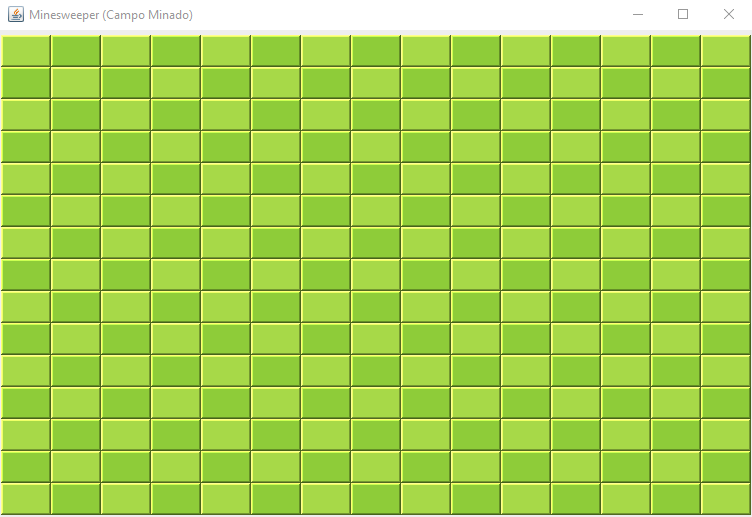
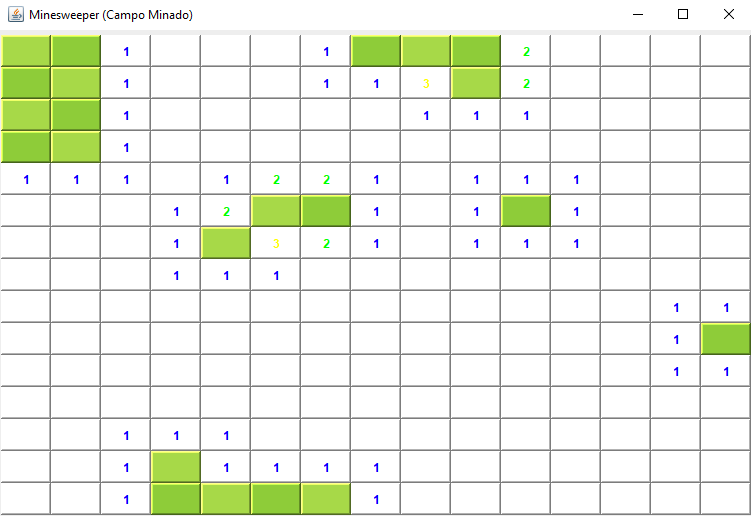
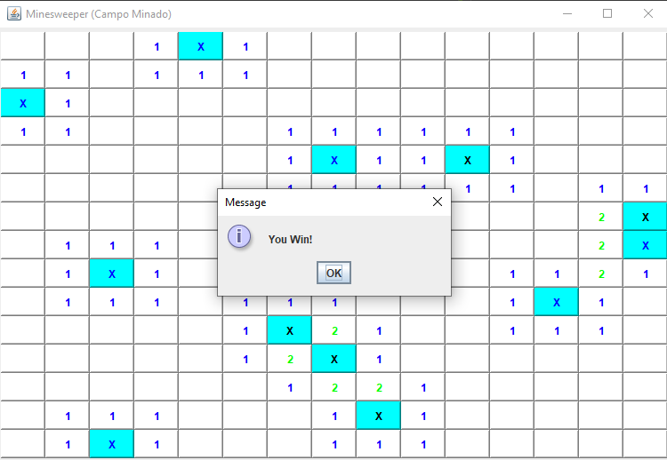
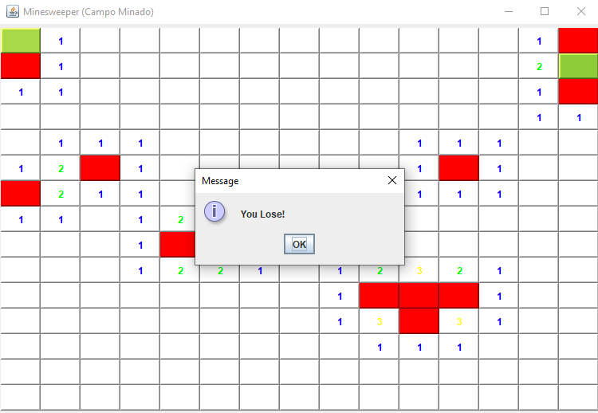

# Jogo Campo Minado (Minesweeper) em Java

Projeto do jogo Campo Minado (Minesweeper), desenvolvido em Java durante o curso: Java 2022 COMPLETO: Do Zero ao Profissional + Projetos! - Instruído por: Leonardo Moura Leitao e Cod3r Cursos Online, através da plataforma Udemy.

## Tecnologias Utilizadas

<ul>
    <li>Java</li>
    <li>Java Swing</li>
    <li>GitHub</li>
    <li>Visual Studio Code</li>
</ul>

## Screenshots

